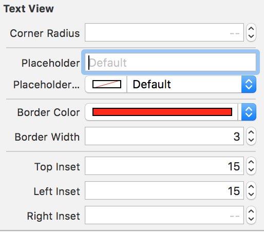

# SMTextView

[](https://travis-ci.org/mandrusiaks/SMTextView)
[](http://cocoapods.org/pods/SMTextView)
[](http://cocoapods.org/pods/SMTextView)
[](http://cocoapods.org/pods/SMTextView)

A custom implementation of UITextView with a placeholder. This implementation contains the ability to customize top, left, bottom, and right insets individually. SMTextView is compatible with Interface Builder.

|  |  |
|:-----------------------------------------------:|:----------------------------------------:|

## Example

To run the example project, clone the repo, and run `pod install` from the Example directory first.

## Requirements

## Installation

### CocoaPods
SMTextView is available through [CocoaPods](http://cocoapods.org). To install
it, simply add the following line to your Podfile:

```ruby
pod "SMTextView"
```

### Manual

Alternatively, you can simply add ```SMTextView.swift``` to your project.


## License

SMTextView is available under the MIT license. See the LICENSE file for more info.
